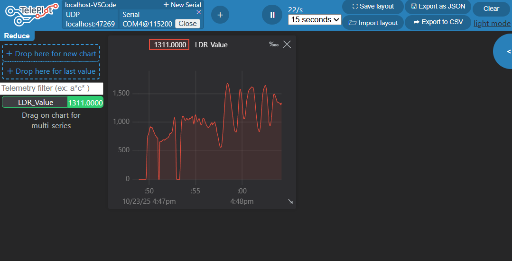

#  Dự Án Đọc Cảm Biến Ánh Sáng LDR & Vẽ Đồ Thị (ESP32 - PlatformIO)

###  Mô Tả Dự Án
Dự án này sử dụng vi điều khiển ESP32 và PlatformIO framework để đọc giá trị tương tự (ADC) từ một mạch cảm biến ánh sáng (LDR). Giá trị ADC (0-4095) được truyền liên tục qua giao tiếp Serial (UART) và được hiển thị dưới dạng đồ thị thời gian thực bằng công cụ Teleplot (VS Code Extension). Dự án minh họa cho việc thu thập dữ liệu cảm biến và trực quan hóa dữ liệu trong môi trường nhúng.

###  Cấu Hình Phần Cứng
- **Vi điều khiển:** ESP32 Dev Module
- **Cảm biến:** LDR (Quang trở)
- **Kết nối:** LDR được mắc trong mạch cầu chia điện áp, nối với chân **GPIO34**.
- **Thông số Serial:** 115200 Baud

###  Đồ Thị Cường Độ Ánh Sáng
Dưới đây là ảnh chụp màn hình đồ thị ánh sáng theo thời gian thực thu được từ Teleplot. Trục Y thể hiện giá trị ADC (0-4095).

###  Cách Sử Dụng
1.  Kết nối phần cứng như mô tả.
2.  Cấu hình `platformio.ini` và `src/main.cpp`.
3.  Upload code lên ESP32.
4.  Mở Teleplot trong VS Code và kết nối với cổng Serial ở tốc độ 115200.